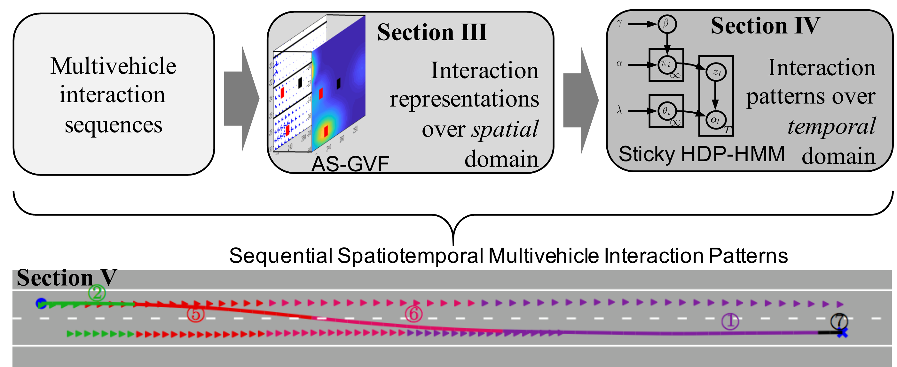
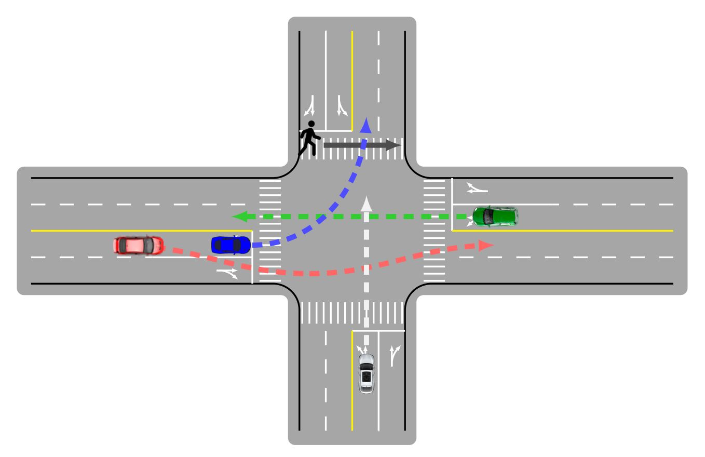

I'm a Ph.D. candidate at McGill University under the supervision of Prof. [Lijun Sun](https://lijunsun.github.io/).
Previously, I was a visiting researcher with the Robotics Institute, Carnegie Mellon University (CMU) in 2023,
supervised by Prof. Changliu Liu; the Department of Mechanical Engineering, UC Berkeley from 2019 to 2020, supervised by
Prof. Masayoshi Tomizuka; and the Department of Mechanical Engineering at CMU in 2018.

My research interests are Bayesian learning, spatiotemporal modeling, macro/micro driving behavior analysis, and
multi-agent interaction modeling in intelligent transportation systems. Specifically, I'm more interested in revealing
the mechanisms of dynamic interactions conveyed in microscopic human driving behaviors and investigating how the
interactive behaviors impact macroscopic traffic flow dynamics.

👋 Please feel free to contact me to schedule a quick discussion if you are interested in collaborating with me.

News
=====

*  New!  Our paper "Learning Car-Following Behaviors Using Bayesian Matrix Normal Mixture Regression" was accepted at IEEE IV24'. [[arXiv](https://arxiv.org/pdf/2404.16023)]
*  New!  Our paper "Calibrating Car-Following Models via Bayesian Dynamic Regression" has been selected for the PODIUM presentation at the 25th International Symposium on Transportation and Traffic Theory ([ISTTT25](https://limos.engin.umich.edu/isttt25/)). See you in Ann Arbor! [[arXiv](https://arxiv.org/pdf/2307.03340.pdf)]
*  New!  I have won the **Honorable Mention Award** for the [2024 Clifford Spiegelman Student Paper Competition](https://community.amstat.org/tsig/events/papercompetition). Thanks, the TSIG of the American Statistical Association!
*  New!  Our paper "Bayesian Calibration of the IDM" was accepted to IEEE Transactions on Intelligent Transportation Systems. [[IEEE TITS](https://ieeexplore.ieee.org/document/10415310)][[arXiv](https://arXiv.org/abs/2210.03571)] [[code](https://github.com/Chengyuan-Zhang/IDM_Bayesian_Calibration)] [[presentation](https://youtu.be/GIqcL6I7MsU)] [[poster](../files/TRB_poster_MA_IDM_Chengyuan_2022.pdf)]
*  New!  I will organize the 2nd International Workshop on [Socially Interactive Autonomous Mobility (SIAM)](https://interactive-driving.github.io/) at IV24' in Jeju Shinhwa World, Jeju Island, Korea. Welcome to join us on June 2nd, 2024! [[CFP]](https://interactive-driving.github.io/files/CFP-IV24-SIAM_Workshop.pdf)

<button onclick="window.location.href='https://chengyuan-zhang.github.io/news/';">Read more</button>

&nbsp;

Featured Research
======

## Bayesian Calibration of the Car-Following Models

Chengyuan Zhang and Lijun Sun. *IEEE Transaction on Intelligent Transportation Systems.*

<iframe width="640" height="400" src="https://www.youtube.com/embed/GIqcL6I7MsU" title="Chengyuan Zhang: Bayesian Calibration of the Intelligent Driver Model | TFTC General Webinar Series" frameborder="0" allow="accelerometer; autoplay; clipboard-write; encrypted-media; gyroscope; picture-in-picture; web-share" allowfullscreen></iframe>

  
<b>[Abstract]</b>

Accurate calibration of car-following models is essential for understanding human driving behaviors and implementing
high-fidelity microscopic simulations. This work proposes a memory-augmented Bayesian calibration technique to capture
both uncertainty in the model parameters and the temporally correlated behavior discrepancy between model predictions
and observed data. Specifically, we characterize the parameter uncertainty using a hierarchical Bayesian framework and
model the temporally correlated errors using Gaussian processes. We apply the Bayesian calibration technique to the
intelligent driver model (IDM) and develop a novel stochastic car-following model named memory-augmented IDM (MA-IDM).
To evaluate the effectiveness of MA-IDM, we compare the proposed MA-IDM with Bayesian IDM in which errors are assumed to
be i.i.d., and our simulation results based on the HighD dataset show that MA-IDM can generate more realistic driving
behaviors and provide better uncertainty quantification than Bayesian IDM. By analyzing the lengthscale parameter of the
Gaussian process, we also show that taking the driving actions from the past five seconds into account can be helpful in
modeling and simulating the human driver’s car-following behaviors.

- Access our preprint via: GP+IDM [[IEEE TITS](https://
  github.com/Chengyuan-Zhang/IDM_Bayesian_Calibration)] [[arXiv](https://arxiv.org/abs/2210.03571)] and
  AR+IDM [[arXiv](https://arxiv.org/pdf/2307.03340.pdf)].
- Codes are available: [[Github repo](https://github.com/Chengyuan-Zhang/IDM_Bayesian_Calibration)].
- Presentation: [[recording](https://youtu.be/GIqcL6I7MsU)] [[poster](../files/TRB_poster_MA_IDM_Chengyuan_2022.pdf)].

   

## Spatiotemporal Learning of Multivehicle Interaction Patterns in Lane-Change Scenarios

Chengyuan Zhang, Jiacheng Zhu, Wenshuo Wang, and Junqiang Xi. *IEEE Transaction on Intelligent Transportation Systems.*

[//]: # (
)

[//]: # (  )

[//]: # (
)

<iframe width="640" height="360" src="https://www.youtube.com/embed/AcyDn43hb7I" title="Demos for Spatiotemporal Learning of Multivehicle Interaction Patterns in Lane-Change Scenarios;" frameborder="0" allow="accelerometer; autoplay; clipboard-write; encrypted-media; gyroscope; picture-in-picture; web-share" allowfullscreen></iframe>

  
<b>[Abstract]</b>

Interpretation of common-yet-challenging interaction scenarios can benefit well-founded decisions for autonomous
vehicles. Previous research achieved this using their prior knowledge of specific scenarios with predefined models,
limiting their adaptive capabilities. This paper describes a Bayesian nonparametric approach that leverages continuous (
i.e., Gaussian processes) and discrete (i.e., Dirichlet processes) stochastic processes to reveal underlying interaction
patterns of the ego vehicle with other nearby vehicles. Our model relaxes dependency on the number of surrounding
vehicles by developing an acceleration-sensitive velocity field based on Gaussian processes. The experiment results
demonstrate that the velocity field can represent the _spatial_ interactions between the ego vehicle and its
surroundings. Then, a discrete Bayesian nonparametric model, integrating Dirichlet processes and hidden Markov models,
is developed to learn the interaction patterns over the _temporal_ space by segmenting and clustering the sequential
interaction data into interpretable granular patterns automatically. We then evaluate our approach in the highway
lane-change scenarios using the highD dataset collected from real-world settings. Results demonstrate that our proposed
Bayesian nonparametric approach provides an insight into the complicated lane-change interactions of the ego vehicle
with multiple surrounding traffic participants based on the interpretable interaction patterns and their transition
properties in temporal relationships. Our proposed approach sheds light on efficiently analyzing other kinds of
multi-agent interactions, such as vehicle-pedestrian interactions.

- Access our paper via: [[arXiv](https://arxiv.org/pdf/2003.00759v2.pdf)]
  , [[paper](https://ieeexplore.ieee.org/document/9357407)],
  or [[project website](https://chengyuan-zhang.github.io/Multivehicle-Interaction/)].
- Watch the demos via: [[YouTube](https://youtu.be/AcyDn43hb7I)].
- Code for implementing Gaussian Velocity
  Field: [[Github repo](https://github.com/Chengyuan-Zhang/Gaussian_Velocity_Field)].
- Also check the supplements via: [[Spatiotemporal_Appendix.pdf](./files/Spatiotemporal_Appendix.pdf)].

 

## Social Interactions for Autonomous Driving: A Review and Perspective

Wenshuo Wang, Letian Wang, Chengyuan Zhang, Changliu Liu, and Lijun Sun. *Foundations and Trends in Robotics*.

  

  
<b>[Abstract]</b>

No human drives a car in a vacuum; she/he must negotiate with other road users to achieve their goals in social traffic
scenes. A rational human driver can interact with other road users in a socially-compatible way through implicit
communications to complete their driving tasks smoothly in interaction-intensive, safety-critical environments. This
paper aims to review the existing approaches and theories to help understand and rethink the interactions among human
drivers toward social autonomous driving. We take this survey to seek the answers to a series of fundamental questions:

1) What is social interaction in road traffic scenes?
2) How to measure and evaluate social interaction?
3) How to model and reveal the process of social interaction?
4) How do human drivers reach an implicit agreement and negotiate smoothly in social interaction?

This paper reviews various approaches to modeling and learning the social interactions between human drivers, ranging
from optimization theory, deep learning, and graphical models to social force theory and behavioral & cognitive science.
We also highlight some new directions, critical challenges, and opening questions for future research.

- Access our book
  via: [[ebook](https://www.nowpublishers.com/article/Details/ROB-078)], [[arXiv](https://arxiv.org/abs/2208.07541)],
  or [[project website](https://chengyuan-zhang.github.io/Multivehicle-Interaction/)].

  

## An Efficient Parking Solution: A Cam-Linkage Double-Parallelogram Mechanism Based 1-Degrees of Freedom Stack Parking System

Chengyuan Zhang, Xiaomin Zhang, Hongyun Ye, Ming Wei, and Xianxiong Ning. *ASME Journal of Mechanisms and Robotics*.

<iframe width="1280" height="462" src="https://www.youtube.com/embed/lmwdDsUXUw8" title="An Efficient Parking Solution: A Novel Stack Parking System" frameborder="0" allow="accelerometer; autoplay; clipboard-write; encrypted-media; gyroscope; picture-in-picture; web-share" allowfullscreen></iframe>

- This is a very interesting mechanical work (a.k.a. big toy) that was done during my undergraduate study.
- Access our work
  via: [[ASME JMR](https://doi.org/10.1115/1.4043688)].

  

Thanks & Fundings
======
 

     &nbsp; &nbsp; &nbsp; &nbsp; &nbsp;  
     &nbsp; &nbsp; &nbsp; &nbsp; &nbsp; 

