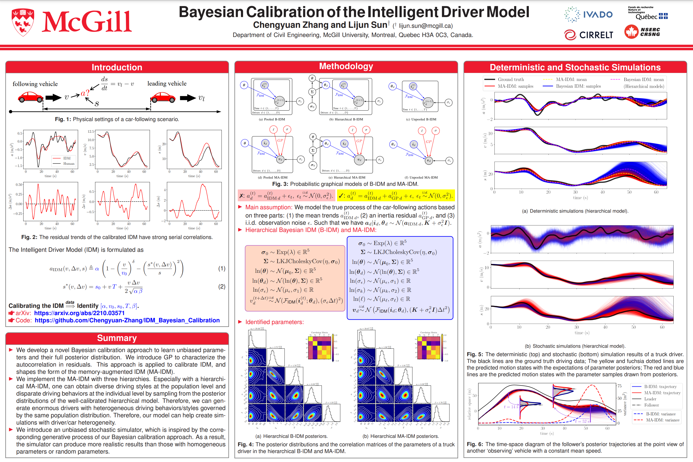

I'm a Ph.D. student at McGill University under the supervision of
Prof. [Lijun Sun](https://lijunsun.github.io/). Previously, I was a visiting researcher with the Robotics Institute,
Carnegie Mellon University (CMU) in 2023, supervised by Prof. Changliu Liu; the Department of Mechanical Engineering, UC
Berkeley from 2019 to 2020, supervised by Prof. Masayoshi Tomizuka; and the Department of Mechanical Engineering at CMU
in 2018.

My research interests are Bayesian learning, macro/micro driving behavior analysis, and multi-agent interaction modeling
in intelligent transportation systems. Specifically, I'm more interested in revealing the mechanisms of social
interactions conveyed in microscopic human driving behaviors and investigating how the interactive behaviors impact the
macroscopic traffic flow dynamics.

Please feel free to contact me if you are interested in collaborating with me.

News
=====

*  New!  07/2023: One paper is accepted at IEEE ITSC23 [[arXiv](https://arxiv.org/pdf/2307.16127.pdf)].
*  New!  07/2023: Please check out our latest preprint titled "Calibrating Car-Following Models via Bayesian Dynamic Regression" on [[arXiv](https://arxiv.org/pdf/2307.03340.pdf)].
*  New!  07/2023: Our paper "Discovering dynamic patterns from spatiotemporal data with time-varying low-rank autoregression" was accepted to IEEE Transactions on Knowledge and Data Engineering. [[paper](https://ieeexplore.ieee.org/document/10177995)]
*  New!  07/2023: I am thrilled to share a significant milestone in my academic journey - I have recently reached 100 citations on Google Scholar!
*  New!  06/2023: I'm organizing the 1st International Workshop on [Socially Interactive Autonomous Mobility (SIAM)](https://interactive-driving.github.io/) at IV23' in Anchorage, Alaska, USA. Welcome to join us on June 4th, 2023!

<button onclick="window.location.href='https://chengyuan-zhang.github.io/news/';">Read more</button>

&nbsp;

Featured Research
======

## Bayesian Calibration of the Car-Following Models

Chengyuan Zhang and Lijun Sun. *Available on arXiv.*

  

  
<b>[Abstract]</b>

Accurate calibration of car-following models is essential for investigating microscopic human driving behaviors. This
work proposes a memory-augmented Bayesian calibration approach, which leverages the Bayesian inference and stochastic
processes (i.e., Gaussian processes) to calibrate an unbiased car-following model while extracting the serial
correlations of residual. This calibration approach is applied to the intelligent driver model (IDM) and develops a
novel model named MA-IDM. To evaluate the effectiveness of the developed approach, three models with different
hierarchies (i.e., pooled, hierarchical, and unpooled) are tested. Experiments demonstrate that the MA-IDM can estimate
the noise level of unrelated errors by decoupling the serial correlation of residuals. Furthermore, a stochastic
simulation method is also developed based on our Bayesian calibration approach, which can obtain unbiased posterior
motion states and generate anthropomorphic driving behaviors. Simulation results indicate that the MA-IDM outperforms
Bayesian IDM in simulation accuracy and uncertainty quantification. With this Bayesian approach, we can generate
enormous but nonidentical driving behaviors by sampling from the posteriors, which can help develop a realistic traffic
simulator.

- Access our preprint via: GP+IDM [[arXiv](https://arxiv.org/abs/2210.03571)] and
  AR+IDM [[arXiv](https://arxiv.org/pdf/2307.03340.pdf)].
- Codes are available: [[Github repo](https://github.com/Chengyuan-Zhang/IDM_Bayesian_Calibration)].
- Presentation: [[recording](https://youtu.be/GIqcL6I7MsU)] [[poster](../files/TRB_poster_MA_IDM_Chengyuan_2022.pdf)].

   

## Spatiotemporal Learning of Multivehicle Interaction Patterns in Lane-Change Scenarios

Chengyuan Zhang, Jiacheng Zhu, Wenshuo Wang, and Junqiang Xi. *IEEE Transaction on Intelligent Transportation Systems.*

  

  
<b>[Abstract]</b>

Interpretation of common-yet-challenging interaction scenarios can benefit well-founded decisions for autonomous
vehicles. Previous research achieved this using their prior knowledge of specific scenarios with predefined models,
limiting their adaptive capabilities. This paper describes a Bayesian nonparametric approach that leverages continuous (
i.e., Gaussian processes) and discrete (i.e., Dirichlet processes) stochastic processes to reveal underlying interaction
patterns of the ego vehicle with other nearby vehicles. Our model relaxes dependency on the number of surrounding
vehicles by developing an acceleration-sensitive velocity field based on Gaussian processes. The experiment results
demonstrate that the velocity field can represent the _spatial_ interactions between the ego vehicle and its
surroundings. Then, a discrete Bayesian nonparametric model, integrating Dirichlet processes and hidden Markov models,
is developed to learn the interaction patterns over the _temporal_ space by segmenting and clustering the sequential
interaction data into interpretable granular patterns automatically. We then evaluate our approach in the highway
lane-change scenarios using the highD dataset collected from real-world settings. Results demonstrate that our proposed
Bayesian nonparametric approach provides an insight into the complicated lane-change interactions of the ego vehicle
with multiple surrounding traffic participants based on the interpretable interaction patterns and their transition
properties in temporal relationships. Our proposed approach sheds light on efficiently analyzing other kinds of
multi-agent interactions, such as vehicle-pedestrian interactions.

- Access our paper via: [[arXiv](https://arxiv.org/pdf/2003.00759v2.pdf)]
  , [[paper](https://ieeexplore.ieee.org/document/9357407)],
  or [[project website](https://chengyuan-zhang.github.io/Multivehicle-Interaction/)].
- Watch the demos via: [[YouTube](https://youtu.be/AcyDn43hb7I)].
- Code for implementing Gaussian Velocity
  Field: [[Github repo](https://github.com/Chengyuan-Zhang/Gaussian_Velocity_Field)].
- Also check the supplements via: [[Spatiotemporal_Appendix.pdf](./files/Spatiotemporal_Appendix.pdf)].

 

## Social Interactions for Autonomous Driving: A Review and Perspective.

Wenshuo Wang, Letian Wang, Chengyuan Zhang, Changliu Liu, and Lijun Sun. *Foundations and Trends in Robotics*.

  

  
<b>[Abstract]</b>

No human drives a car in a vacuum; she/he must negotiate with other road users to achieve their goals in social traffic
scenes. A rational human driver can interact with other road users in a socially-compatible way through implicit
communications to complete their driving tasks smoothly in interaction-intensive, safety-critical environments. This
paper aims to review the existing approaches and theories to help understand and rethink the interactions among human
drivers toward social autonomous driving. We take this survey to seek the answers to a series of fundamental questions:

1) What is social interaction in road traffic scenes?
2) How to measure and evaluate social interaction?
3) How to model and reveal the process of social interaction?
4) How do human drivers reach an implicit agreement and negotiate smoothly in social interaction?

This paper reviews various approaches to modeling and learning the social interactions between human drivers, ranging
from optimization theory, deep learning, and graphical models to social force theory and behavioral & cognitive science.
We also highlight some new directions, critical challenges, and opening questions for future research.

- Access our book
  via: [[ebook](https://www.nowpublishers.com/article/Details/ROB-078)], [[arXiv](https://arxiv.org/abs/2208.07541)],
  or [[project website](https://chengyuan-zhang.github.io/Multivehicle-Interaction/)].

  

Thanks & Fundings
======
 

     &nbsp; &nbsp; &nbsp; &nbsp; &nbsp;  
     &nbsp; &nbsp; &nbsp; &nbsp; &nbsp; 

