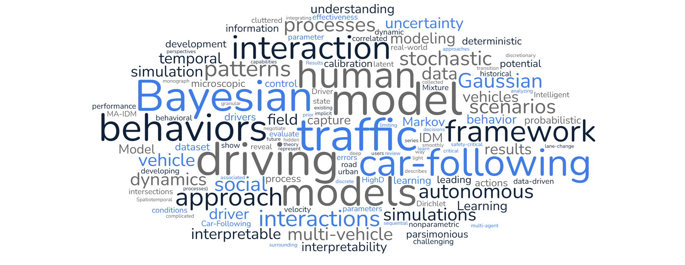

[//]: # (APA)

This selected publication list is not frequently updated. Please see my Google Scholar for recent updates. (*
Corresponding Author, = Equal Contributions.)

## Preprints

- <u>Chengyuan Zhang</u>, Cathy Wu, and Lijun Sun* (2025). ["Markov Regime-Switching Intelligent Driver Model for
  Interpretable
  Car-Following Behavior"](https://arxiv.org/pdf/2506.14762). [code coming soon]
- <u>Chengyuan Zhang</u>, Zhengbing He, Cathy Wu, and Lijun Sun* (
  2025). ["When Context Is Not Enough: Modeling Unexplained
  Variability in Car-Following Behavior"](https://arxiv.org/abs/2507.07012). [code coming soon]

## Journal publications

- Xinyu Chen, <u>Chengyuan Zhang</u>, Xi-Le Zhao, Nicolas Saunier*, and Lijun Sun (
  2025). ["Forecasting sparse movement speed of urban road networks with nonstationary temporal matrix factorization."](https://pubsonline.informs.org/doi/abs/10.1287/trsc.2024.0629)
  Transportation
  Science. [[code](https://github.com/xinychen/tracebase)] [[blog I](https://medium.com/p/b1c59faf05ea)] [[blog II](https://medium.com/p/4705df163fcf)] [[slides](https://xinychen.github.io/slides/notmf.pdf)]
- <u>Chengyuan Zhang</u>, Wenshuo Wang, and Lijun Sun* (2024). ["Calibrating Car-Following Models via Bayesian Dynamic
  Regression"](https://authors.elsevier.com/sd/article/S0968-090X(24)00240-7). Transportation research part C: emerging
  technologies. (ISTTT25 Special
  Issue) [[code](https://github.com/Chengyuan-Zhang/IDM_Bayesian_Calibration)] [[presentation](https://youtu.be/GIqcL6I7MsU)] [[slides](../_talks/ISTTT25_slides_Chengyuan.pdf)]
- <u>Chengyuan Zhang</u> and Lijun Sun* (2023).
  ["Bayesian Calibration of the Intelligent Driver Model"](https://ieeexplore.ieee.org/document/10415310). IEEE
  Transactions on Intelligent Transportation
  Systems. [[code](https://github.com/Chengyuan-Zhang/IDM_Bayesian_Calibration)] [[presentation](https://youtu.be/GIqcL6I7MsU)] [[poster](../files/TRB_poster_MA_IDM_Chengyuan_2022.pdf)]
- Xiaoxu Chen, <u>Chengyuan Zhang</u>, Zhanhong Cheng, Yuang Hou, and Lijun Sun* (
  2023). ["A Bayesian Gaussian Mixture Model
  for Probabilistic Modeling of Car-Following Behaviors"](https://ieeexplore.ieee.org/document/10337758/). IEEE
  Transactions on Intelligent Transportation
  Systems.
- Xinyu Chen (=), <u>Chengyuan Zhang</u> (=), Xiaoxu Chen, Nicolas Saunier, and Lijun Sun* (2023).
  ["Discovering dynamic patterns from spatiotemporal data with time-varying low-rank autoregression"](https://ieeexplore.ieee.org/document/10177995).
  IEEE Transactions on Knowledge and Data
  Engineering. [[data & code](https://github.com/xinychen/vars)] [[blog](https://medium.com/p/b75d23b23a62)]
- <u>Chengyuan Zhang</u>, Jiacheng Zhu, Wenshuo Wang*, and Junqiang Xi (2021). ["Spatiotemporal learning of multivehicle
  interaction patterns in lane-change scenarios"](https://ieeexplore.ieee.org/abstract/document/9357407). IEEE
  Transactions on Intelligent Transportation
  Systems. [[code](https://github.com/Chengyuan-Zhang/Gaussian_Velocity_Field)] [[demo](https://youtu.be/AcyDn43hb7I)] [[project website](https://chengyuan-zhang.github.io/Multivehicle-Interaction/)]
- <u>Chengyuan Zhang</u>, Xiaomin Zhang, Hongyun Ye, Ming Wei, and Xianxiong Ning* (
  2019).[" An efficient parking solution:
  a cam-linkage double-parallelogram mechanism based 1-degrees of freedom stack parking system"](https://mechanismsrobotics.asmedigitalcollection.asme.org/article.aspx?articleid=2733268).
  Journal of Mechanisms
  and Robotics, 11(4). [[demo](https://youtu.be/lmwdDsUXUw8)]
- <u>Chengyuan Zhang</u> and Jian Xiao* (2018). ["Chaotic behavior and feedback control of
  magnetorheological suspension system with fractional-order derivative"](https://asmedigitalcollection.asme.org/computationalnonlinear/article/13/2/021007/473529/Chaotic-Behavior-and-Feedback-Control-of).
  Journal of Computational and Nonlinear
  Dynamics, 13(2).

## Conference publications

- <u>Chengyuan Zhang</u> (=), Kehua Chen (=), Meixin Zhu*, Hai Yang, and Lijun Sun (2024, May). ["Learning Car-Following
  Behaviors Using Bayesian Matrix Normal Mixture Regression"](https://ieeexplore.ieee.org/document/10588568). In 2024
  IEEE Intelligent Vehicles
  Symposium (IV).
  IEEE.
- <u>Chengyuan Zhang</u>, Rui Chen, Jiacheng Zhu, Wenshuo Wang, Changliu Liu, and Lijun Sun* (2023, September).
  ["Interactive Car-Following: Matters but NOT Always"](https://ieeexplore.ieee.org/abstract/document/10421996). In 2023
  IEEE 26th International Conference on Intelligent Transportation Systems (ITSC) (pp. 5120-5125).
  IEEE.
- Wenshuo Wang, <u>Chengyuan Zhang</u>, Pin Wang, and Ching-Yao Chan* (2020, October). ["Learning Representations for
  Multi-Vehicle Spatiotemporal Interactions with Semi-Stochastic Potential Fields"](https://ieeexplore.ieee.org/abstract/document/9304849).
  In 2020 IEEE Intelligent Vehicles
  Symposium (IV) (pp. 1935-1940). IEEE.
- <u>Chengyuan Zhang</u>, Jiacheng Zhu, Wenshuo Wang, and Ding Zhao* (2019, October). ["A general framework of learning
  multi-vehicle interaction patterns from video"](https://ieeexplore.ieee.org/abstract/document/8917212). In 2019 IEEE
  Intelligent Transportation Systems Conference (ITSC) (pp.
  4323-4328).
  IEEE. [[project website](https://chengyuan-zhang.github.io/Multivehicle-Interaction/)]

## Books

- Wenshuo Wang, Letian Wang, <u>Chengyuan Zhang</u>, Changliu Liu, and Lijun Sun (2022). ["Social interactions for
  autonomous driving: A review and perspectives"](https://www.nowpublishers.com/article/Details/ROB-078). Foundations
  and Trends® in Robotics, 10(3-4),
  198-376. [[arXiv](https://arXiv.org/abs/2208.07541)] [[project website](https://chengyuan-zhang.github.io/Multivehicle-Interaction/)]
- 陈新宇，金杰灵，廖琼华，**张程远**
  ，陈晓旭. ["LaTeX论文写作教程 (Academic Writing with LaTeX)"](https://github.com/xinychen/latex-cookbook).
  清华大学出版社，2023. [[清华大学出版社京东自营官方旗舰店](https://item.jd.com/14204878.html)]

## Patents

- <u>Chengyuan Zhang</u>, Xiaomin Zhang, Hongyun Ye, Jinming Shi, Manzhi Wang, and Xianxiong Ning.
  [Cam-connecting rod type mechanical three-dimensional parking device.](https://patents.google.com/patent/CN108222589B/en)
  CN108222589B, China, 2018
