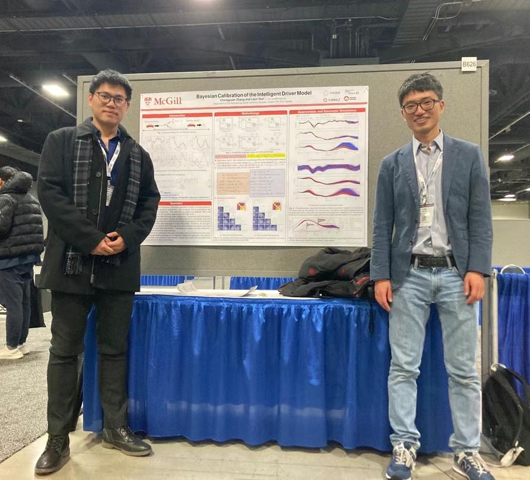
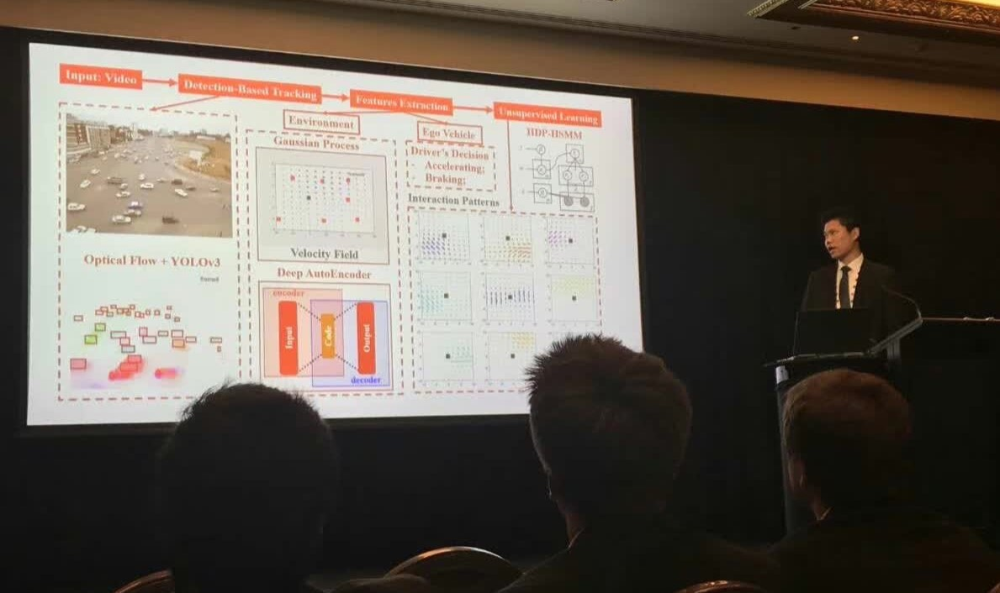
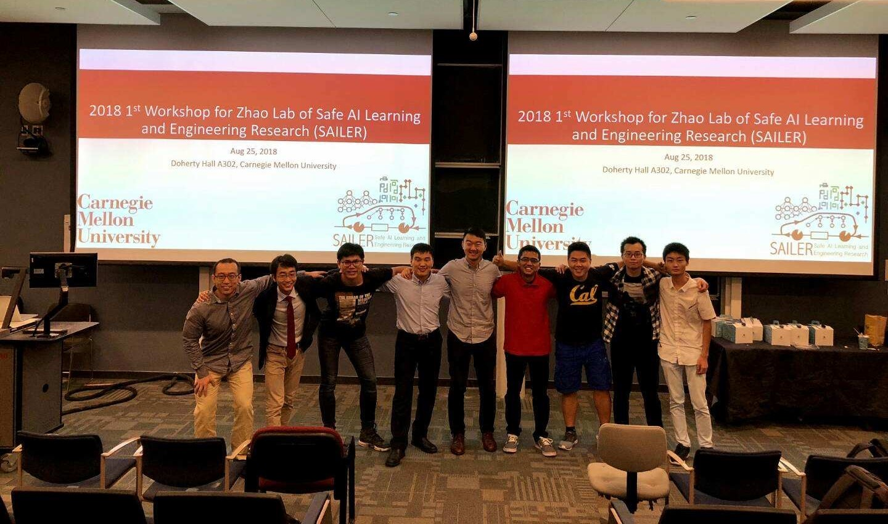

## From Micro Interactions to Traffic Flow: Stochastic Driver Models for Realistic Traffic Simulation
_Oct. 2025, Online_ \
Invited talk @ Massachusetts Institute of Technology, MIT WU Lab

## Stochastic Modeling and Simulations of Car-Following Behaviors
_Feb. 2025, Online_ \
Invited talk @ Massachusetts Institute of Technology, JTL Research Seminar [[slides](../_talks/250213_MIT_JTL_seminar.pdf)] [[web](https://sites.mit.edu/jtl-seminar/)]

## Calibrating Car-Following Models via Bayesian Dynamic Regression
_July 2024, Ann Arbor, Michigan, US_ \
Conference Podium Presentation @ The 25th International Symposium on Transportation and Traffic Theory (ISTTT25) [[slides](../_talks/ISTTT25_slides_Chengyuan.pdf)]

  
  

## Bayesian Calibration of the IDM
_Feb. 2023, Online_\
Invited Talk @ Traffic Flow Theory and Characteristics (ACP50) general webinar series [[flyer](../_talks/230217_Chengyuan_Zhang_Flyer.pdf)] [[recording](https://youtu.be/GIqcL6I7MsU)]
<iframe width="480" height="300" src="https://www.youtube.com/embed/GIqcL6I7MsU" title="Chengyuan Zhang: Bayesian Calibration of the Intelligent Driver Model | TFTC General Webinar Series" frameborder="0" allow="accelerometer; autoplay; clipboard-write; encrypted-media; gyroscope; picture-in-picture; web-share" allowfullscreen></iframe>

## Bayesian Calibration of the IDM
_Jan. 2023, Washington, DC, US_ \
Conference Poster Presentation @ TRB Annual Meeting 2023

  

## A General Framework of Learning Multi-Vehicle Interaction Patterns from Video
_Oct. 2019, Auckland, New Zealand_ \
Conference Podium Presentation @ IEEE International Conference on Intelligent Transportation Systems (IEEE ITSC 2019)

  

## An Efficient Parking Solution: A Cam-Linkage Double-Parallelogram Mechanism Based 1-DOF Stack Parking System
_Aug. 2018, Department of Mechanical Engineering, Carnegie Mellon University, Pittsburgh, Pennsylvania, US_ \
Workshop Podium Presentation @ The 1st Workshop for SAILER at CMU [[slides](../_talks/180825_CMU_Workshop.pdf)]

  

