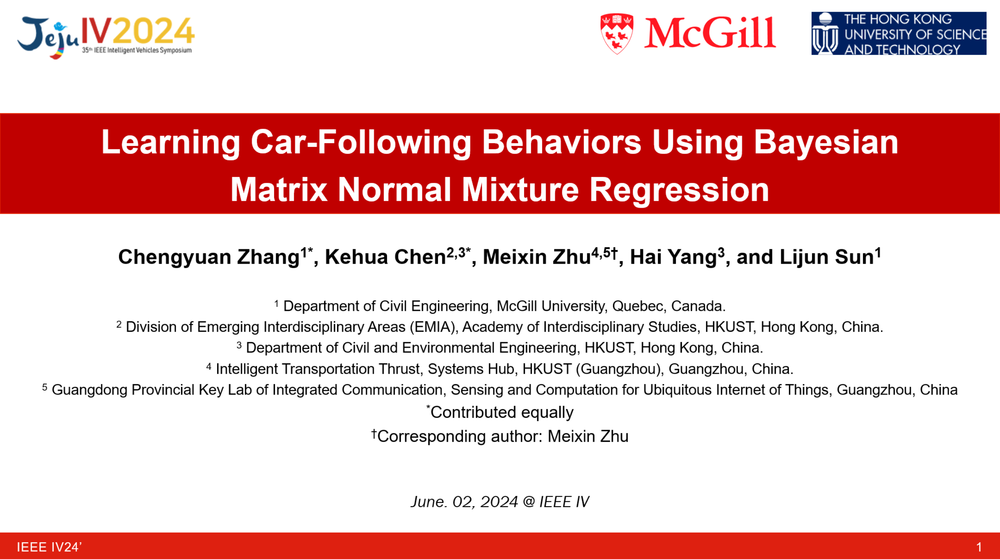

Talks and Presentations
======

## Learning Car-Following Behaviors Using Bayesian Matrix Normal Mixture Regression
June. 2024, Jeju Shinhwa World, Jeju Island, Korea \
Conference Podium Presentation @ 35th IEEE Intelligent Vehicles Symposium (IEEE IV 2024)

  

## Interactive Car-Following: Matters but NOT Always
Sept. 2023, Bilbao, Bizkaia, Spain \
Conference Podium Presentation @ 26th IEEE International Conference on Intelligent Transportation Systems (IEEE ITSC 2023)

  

## Bayesian Calibration of the IDM
Feb. 2023, Online\
Invited Talk @ Traffic Flow Theory and Characteristics (ACP50) general webinar series [[flyer](../_talks/230217_Chengyuan_Zhang_Flyer.pdf)] [[recording](https://youtu.be/GIqcL6I7MsU)]
<iframe width="70%" src="https://www.youtube.com/embed/GIqcL6I7MsU" title="Chengyuan Zhang: Bayesian Calibration of the Intelligent Driver Model | TFTC General Webinar Series" frameborder="0" allow="accelerometer; autoplay; clipboard-write; encrypted-media; gyroscope; picture-in-picture; web-share" allowfullscreen></iframe>

## Bayesian Calibration of the IDM
Jan. 2023, Washington, DC, US\
Conference Poster Presentation @ TRB Annual Meeting 2023

  

## A General Framework of Learning Multi-Vehicle Interaction Patterns from Video
Oct. 2019, Auckland, New Zealand\
Conference Podium Presentation @ IEEE International Conference on Intelligent Transportation Systems (IEEE ITSC 2019)

  

## An Efficient Parking Solution: A Cam-Linkage Double-Parallelogram Mechanism Based 1-DOF Stack Parking System
Aug. 2018, Department of Mechanical Engineering, Carnegie Mellon University, Pittsburgh, Pennsylvania, US\
Workshop Podium Presentation @ The 1st Workshop for SAILER at CMU

  

