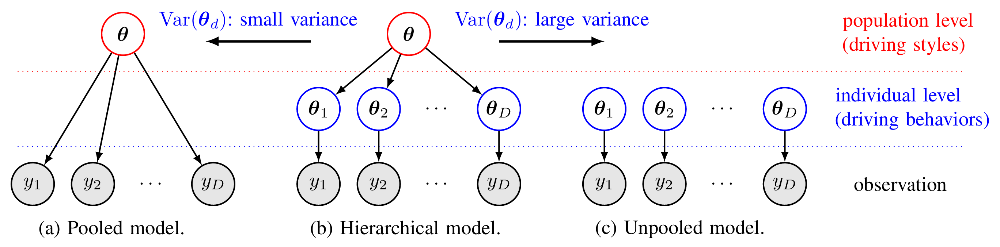

# Hyperparameters in Hierarchical Models: Understanding Pooled, Unpooled, and Hierarchical Approaches

Hierarchical models are powerful tools in statistical modeling and machine learning, enabling us to represent data with
complex dependency structures. These models are particularly useful in contexts where data is naturally grouped or
exhibits multi-level variability. A critical aspect of hierarchical models lies in their hyperparameters, which control
the relationships between different levels of the model.

In this post, we will explore how hyperparameters define and distinguish **pooled**, **unpooled**, and **hierarchical (
partially pooled)** models, and how they influence model flexibility, interpretability, and generalizability.

---

## The Basics: Pooled, Unpooled, and Hierarchical Models

1. **Pooled Models**:
    - All groups are assumed to share the same parameters.
    - The data is "pooled" together to estimate a single global parameter.
    - Example: In a study involving multiple drivers, a pooled model assumes all drivers behave identically and
      estimates a single set of parameters for all.
    - **Hyperparameter Role**: No explicit hyperparameters are required to account for group-level differences, as the
      model does not differentiate between groups.

   **Advantages**:
    - Simple and computationally efficient.
    - Suitable when group differences are negligible.

   **Disadvantages**:
    - Ignores group-specific variability.
    - Can lead to biased estimates if heterogeneity exists.

2. **Unpooled Models**:
    - Each group is treated independently, with separate parameters estimated for each.
    - There is no "borrowing of strength" across groups.
    - Example: In the driver study, each driver's behavior is modeled with entirely distinct parameters.
    - **Hyperparameter Role**: None required for inter-group relationships since groups are modeled independently.

   **Advantages**:
    - Captures group-specific differences effectively.
    - Allows for maximum flexibility.

   **Disadvantages**:
    - Computationally expensive, especially with many groups.
    - Susceptible to overfitting due to the lack of shared information across groups.

3. **Hierarchical (Partially Pooled) Models**:
    - Parameters for each group are drawn from a shared population distribution.
    - This approach balances global patterns (pooling) and individual variability (unpooling).
    - Example: In the driver study, each driver's parameters are assumed to be related, with group-level variations
      modeled as deviations from a population mean.
    - **Hyperparameter Role**: Critical! Hyperparameters define the shared population distribution and the variability
      among groups. These include:
      <ol>
        <li>The mean and variance of the population distribution.</li>
        <li>Priors for group-level parameters (e.g., variances or covariances).</li>
      </ol>
    - **Key Hyperparameter**: The variance of the population distribution determines the degree of pooling:
      <ol>
        <li>Low variance: Groups are assumed to be similar, resembling a pooled model.</li>
        <li>High variance: Groups are treated as distinct, resembling an unpooled model.</li>
      </ol>

   **Advantages**:
    - Captures both global trends and individual differences.
    - Avoids overfitting by regularizing group-specific estimates towards the population mean.
    - Provides better generalizability.

   **Disadvantages**:
    - Computationally more demanding than pooled models.
    - Requires careful specification and tuning of hyperparameters.

---

## Hyperparameters in Practice

In hierarchical models, hyperparameters play a pivotal role in managing the trade-off between pooling and unpooling.
Here’s how they function:

1. **Variance of Group-Level Parameters**:
    - Determines how much individual groups can deviate from the population mean.
    - Small variance: Tighter pooling, leading to similar group parameters.
    - Large variance: Looser pooling, allowing greater flexibility for individual group differences.

2. **Covariance Structure**:
    - When modeling multiple parameters per group, the covariance structure can capture interdependencies among
      parameters.
    - Hyperparameters here define the shape of the covariance matrix (e.g., through LKJ priors in Bayesian settings).

3. **Prior Distributions**:
    - Priors for hyperparameters themselves (e.g., mean and variance) influence model regularization and robustness.
    - Informative priors guide the model when data is sparse; non-informative priors allow data-driven inferences.

---

## Visualizing the Differences

- **Pooled**: A single mean is shared across all groups.
- **Unpooled**: Each group has its own mean, with no interaction or shared structure.
- **Hierarchical**: Each group mean is drawn from a shared population distribution, striking a balance between global
  consistency and local flexibility.

---

## When to Use Each Model?

- **Pooled**: Use when data is limited, and group differences are negligible.
- **Unpooled**: Use when groups are distinct and have sufficient data for independent modeling.
- **Hierarchical**: Use when groups have shared structure but exhibit some variability, especially in multi-level
  datasets or when data per group is sparse.

---

## Conclusion

Hierarchical models, through their hyperparameters, provide a nuanced approach to modeling grouped data. They blend the
simplicity of pooled models and the flexibility of unpooled models, making them a versatile choice in many real-world
applications. By carefully tuning hyperparameters, hierarchical models can achieve an optimal balance, leading to better
predictions and insights.

Understanding and leveraging these hyperparameters is key to unlocking the full potential of hierarchical modeling!

(add references later...)
